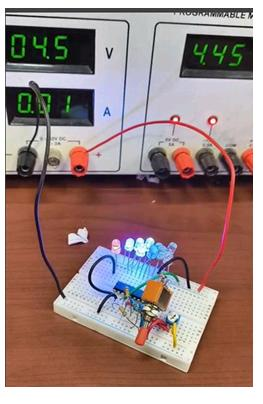

# Battery-Level-Indicator
# Battery Level Indicator

## Overview

This project implements a battery level indicator using the LM3914 IC. The circuit visually indicates the charge level of a battery through a series of 10 LEDs. It is suitable for:

- Battery monitoring systems
- Portable electronic devices
- UPS systems
- Solar power applications
- Rechargeable battery packs

---

## Features

- Simple and reliable battery monitoring
- 10-level LED indication
- Dot mode and bar mode operation
- Adjustable calibration
- Low component count
- Easy PCB implementation

---

## Circuit Diagram

---

## Components Required

| Reference | Value |
|-----------|--------|
| IC1 | LM3914 |
| D1–D10 | LEDs |
| R1 | Current limiting resistor |
| R2 | Calibration resistor |
| R3 | Voltage divider resistor |
| RV1 | Potentiometer |
| SW1 | Mode selection switch |
| Battery | 6V/9V/12V (as required) |

---

## How It Works

1. The battery voltage is applied to the LM3914 input.
2. The IC continuously monitors the battery voltage level.
3. Internal comparators compare the input voltage with preset reference levels.
4. Depending on the battery voltage, the corresponding LEDs turn ON.
5. As the battery voltage increases, more LEDs illuminate.
6. A fully charged battery lights most or all of the LEDs, while a low battery lights only a few LEDs.
7. Switch **SW1** connected to Pin 9 selects the display mode:
   - **Dot Mode** – Only one LED glows at a time.
   - **Bar Mode** – All LEDs up to the measured level glow.
8. Resistor **R3** and potentiometer **RV1** form a voltage divider network used for calibration.
9. The resistor connected to Pins 6 and 7 controls the LED brightness.

---

## Prototype

The prototype demonstrates the practical implementation of the battery level indicator circuit. As the battery voltage changes, the LM3914 drives the appropriate number of LEDs, providing an instant visual indication of the battery charge level.

---

## Applications

- Battery chargers
- UPS battery monitoring
- Solar energy systems
- Automotive battery indicators
- Portable electronic equipment
- Power backup systems
